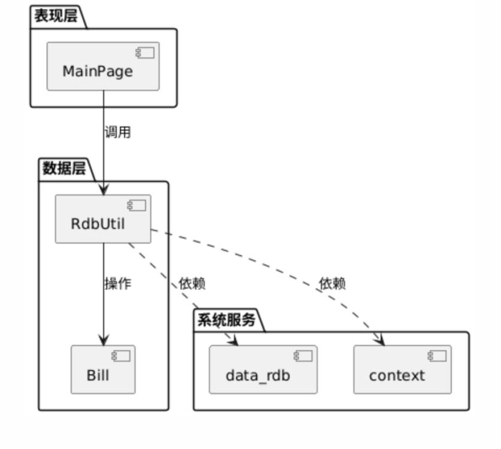
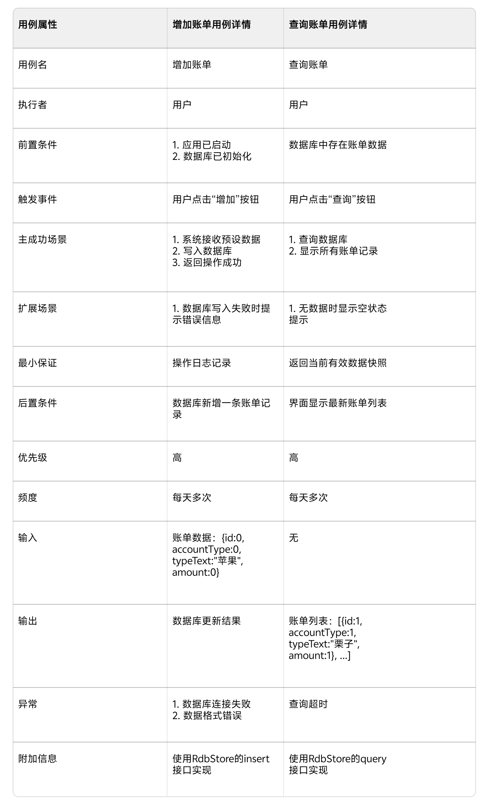
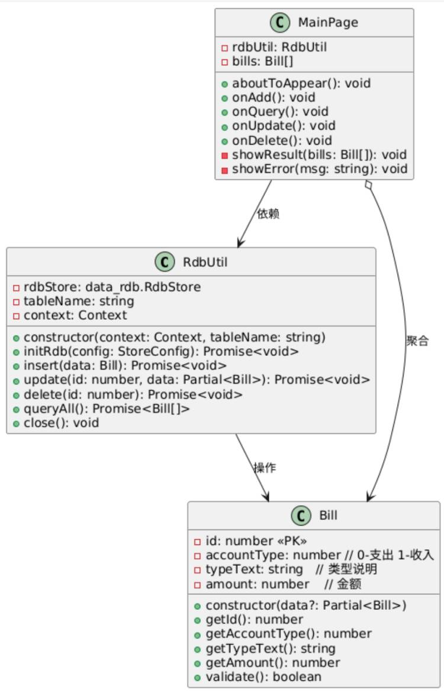
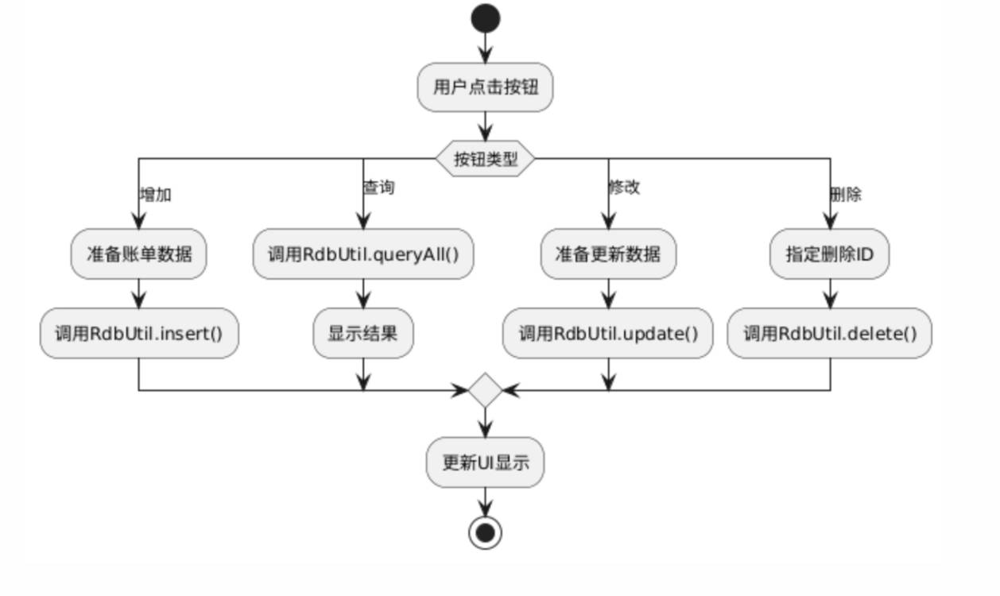
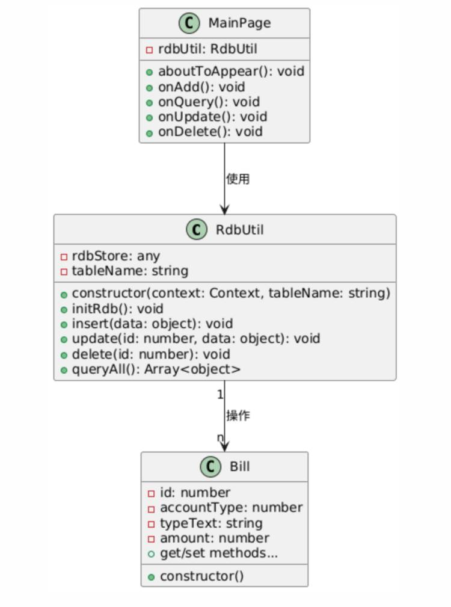
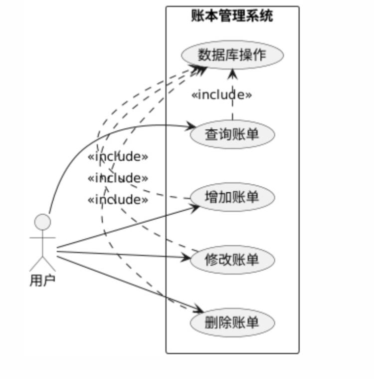

# 实验三报告

> 学号：<*3225706004*>
> 
> 姓名：<*彭溪霖*>
> 
> 指导老师：<*张铠斌*>
> 
> 实验日期：<*2025-03-26*>

## 一、实验目的

- 复习软件工程的基本概念和方法论；
  - 软件生命周期与开发方法论；
    - 结构化分析与设计（SAD）
    - 面向对象分析与设计（OOAD）
- 掌握OOAD与UML图的对应关系；

  - 注意：UML图只是OOAD中的一部分（代码相关的部分），并不是OOAD的全部。例如：
    - 需求分析除了UML图外，还有文档说明；
    - 总体设计除了UML图外，还有UI设计、数据库设计等；
    - 详细设计除了UML图外，还有算法实现（流程图、N-S图、伪代码）、UI的具体实现、数据库的具体实现等；
- 完成教科书中关系数据库实例的UML建模练习；

## 二、实验内容

- 阅读教科书的第9章“数据管理”的第9.4节“关系数据库的开发”；
- 根据理论课所讲内容和软件工程的相关概念，完成教科书上关系数据库实例的UML建模练习；

## 三、实验要求

- 需求分析：完成用例图和用例规约；
- 总体设计：完成类图（静态视图）和活动图（动态视图）；
- 详细设计：完成详细类图和包图；
- 撰写并提交实验报告；
  - <font color=red>实验步骤部分需严格按模板要求撰写；</font>
  - <font color=red>提交时删除掉上文中的“UML提纲.png“图片；</font>

## 四、实验步骤

### 1. 需求分析

#### 1.1 用例图

<>

#### 1.2 用例规约

<>

用例规约格式示例：   

| 字段 | 内容 |
| ---- | ------ |
| 用例名 | ＜用例名应该是一个主动语态动词短语来表示的用例目标＞ | 
| 执行者 | ＜执行者的角色名称或执行者的描述＞ | 
| 前置条件 | ＜系统处于什么状态，才能执行该用例＞ | 
| 触发事件 | ＜触发事件的描述，如时间、条件等＞ | 
| 主成功场景 | ＜用例的主成功场景，即完成该用例的主要功能＞ | 
| 扩展场景 | ＜用例的扩展场景，即完成该用例的附加功能＞ | 
| 最小保证 | ＜在所有退出操作前，如何保证得到必须的信息＞（如：系统运行失败，将其写入日志文件）| 
| 后置条件 | ＜系统执行完该用例后，达到什么状态＞ | 
| 优先级 | ＜用例的优先级，高、中、低＞ | 
| 频度 | ＜每周、每月、每季度、每年、永不＞ | 
| 输入 | ＜用例的输入，包括数据、文件、网络等＞ | 
| 输出 | ＜用例的输出，包括数据、文件、网络等＞ | 
| 异常 | ＜用例的异常情况，包括输入、输出、系统错误等＞ | 
| 附加信息 | ＜用例的附加信息，如备注、说明等＞ | 

### 2. 总体设计

#### 2.1 类图（静态视图）

<>


#### 2.2 活动图（动态视图）

<>

### 3. 详细设计

#### 3.1 详细类图

<>

#### 3.2 包图

<>

### <font color=red>4. 编码（实验四的内容，提交实验三报告时需删除此部分）

#### 4.1 代码实现

<在此处填写你的代码实现（带必要注释及Markdown语法高亮）>

````// src/main/ets/pages/Index.ets
import { AccountData } from '../database/AccountData'; // 导入账户数据类型定义
import AccountTable from '../database/AccountTable';   // 导入数据库操作类
import { common } from '@kit.AbilityKit';            // 导入HarmonyOS能力库

// 应用主页面组件
@Entry
@Component
struct Index {
  // 状态变量：页面消息提示
  @State message: string = '初始化中...';
  // 状态变量：账户数据列表
  @State accounts: AccountData[] = [];

  // 数据库操作实例（初始为null）
  private accountTable: AccountTable | null = null;
  // 获取Stage模型的上下文能力
  private context: common.UIAbilityContext = getContext(this) as common.UIAbilityContext;

  // 组件生命周期：页面即将显示时触发
  aboutToAppear() {
    // 检查上下文是否有效
    if (this.context) {
      // 初始化数据库操作实例
      this.accountTable = new AccountTable(this.context);
      // 加载初始数据
      this.initData();
    } else {
      this.message = '获取上下文失败';
      console.error('Stage模型上下文获取失败');
    }
  }

  /**
   * 初始化数据方法
   * 1. 初始化数据库
   * 2. 查询所有账户数据
   */
  private async initData() {
    if (!this.accountTable) return;

    try {
      // 初始化数据库连接
      await this.accountTable.init();
      // 查询所有账户记录
      this.accounts = await this.accountTable.queryAll();
      // 更新状态提示
      this.message = `加载完成，共 ${this.accounts.length} 条记录`;
    } catch (err) {
      // 错误处理
      this.message = `初始化失败: ${JSON.stringify(err)}`;
      console.error('数据库初始化失败:', err);
    }
  }

  // 构建UI界面
  build() {
    Row() {
      Column() {
        // 顶部消息提示文本
        Text(this.message)
          .fontSize(20)
          .margin(10);

        // 账户数据列表
        List({ space: 10, initialIndex: 0 }) {
          ForEach(this.accounts, (item: AccountData) => {
            ListItem() {
              Row() {
                // 显示账户ID（占宽20%）
                Text(`ID: ${item.id}`).width('20%')
                // 显示账户类型文本（占宽30%）
                Text(item.typeText).width('30%')
                // 显示类型中文描述（支出/收入）
                Text(item.accountType === 0 ? '支出' : '收入').width('20%')
                // 显示金额（格式化显示）
                Text(`¥${item.amount.toFixed(2)}`).width('30%')
              }
              .width('100%')
            }
          }, (item: AccountData) => item.id.toString()) // 使用ID作为列表项唯一键
        }
        .width('100%')
        .height('60%')
        .layoutWeight(1)

        // 添加示例数据按钮
        Button('添加示例数据', { type: ButtonType.Capsule })
          .onClick(async () => {
            if (!this.accountTable) return;

            try {
              // 插入测试数据
              await this.accountTable.insert({
                accountType: 0,       // 类型：支出
                typeText: '餐饮',    // 类型描述
                amount: 50.0         // 金额
              });
              // 重新查询更新列表
              this.accounts = await this.accountTable.queryAll();
              // 更新状态提示
              this.message = `添加成功，共 ${this.accounts.length} 条记录`;
            } catch (err) {
              // 错误处理
              this.message = `添加失败: ${JSON.stringify(err)}`;
              console.error('添加数据失败:', err);
            }
          })
          .margin(10)
      }
      .width('100%')
      .height('100%')
      .padding(12)
    }
    .height('100%')
  }
}```
````build-profile.json5
{
  "apiType": "stageMode",
  "buildOption": {
    "arkOptions": {
      "runtimeOnly": {

      }
    }
  },
  "buildOptionSet": [
    {
      "name": "release",
      "arkOptions": {
        "obfuscation": {
          "ruleOptions": {
            "enable": false,
            "files": ["./obfuscation-rules.txt"]
          }
        }
      }
    }
  ],

  "targets": [
    {
      "name": "default",
      "runtimeOS": "HarmonyOS",
      "source": {},  // 添加必需的 source 字段
      "resource": {}, // 添加必需的 resource 字段

    },
    {
      "name": "ohosTest",
      "runtimeOS": "HarmonyOS"
    }
  ]
}```
````// src/main/ets/common/RdbUtil.ts
import relationalStore from '@ohos.data.relationalStore'; // 导入关系型数据库模块
import common from '@ohos.app.ability.common'; // 导入Ability上下文模块

/**
 * 关系型数据库工具类
 * 封装了HarmonyOS关系型数据库的常用操作
 */
export default class RdbUtil {
  private rdbStore: relationalStore.RdbStore | null = null; // 数据库实例

  /**
   * 构造函数
   * @param context Ability上下文
   * @param tableName 表名
   * @param createTableSql 建表SQL语句
   * @param columns 查询列名数组
   */
  constructor(
    private context: common.UIAbilityContext,
    private tableName: string,
    private createTableSql: string,
    private columns: string[]
  ) {}

  /**
   * 初始化数据库
   * 1. 创建/打开数据库
   * 2. 执行建表SQL
   */
  async initialize(): Promise<void> {
    if (this.rdbStore) return; // 避免重复初始化

    // 数据库配置
    const config: relationalStore.StoreConfig = {
      name: `${this.tableName}.db`, // 数据库文件名
      securityLevel: relationalStore.SecurityLevel.S1 // 安全级别
    };

    try {
      // 异步获取数据库实例
      this.rdbStore = await new Promise((resolve, reject) => {
        relationalStore.getRdbStore(this.context, config, (err, store) => {
          err ? reject(err) : resolve(store);
        });
      });

      // 执行建表语句
      await this.executeSql(this.createTableSql);
    } catch (err) {
      console.error(`Database init failed: ${JSON.stringify(err)}`);
      throw err; // 抛出异常供上层处理
    }
  }

  /**
   * 执行SQL语句（内部方法）
   * @param sql 要执行的SQL语句
   */
  private async executeSql(sql: string): Promise<void> {
    return new Promise((resolve, reject) => {
      this.rdbStore!.executeSql(sql, [], (err) => {
        err ? reject(err) : resolve();
      });
    });
  }

  /**
   * 插入数据
   * @param valueBucket 要插入的数据键值对
   * @returns 插入的行ID
   */
  async insert(valueBucket: relationalStore.ValuesBucket): Promise<number> {
    return new Promise((resolve, reject) => {
      this.rdbStore!.insert(this.tableName, valueBucket, (err, rowId) => {
        err ? reject(err) : resolve(rowId);
      });
    });
  }

  /**
   * 更新数据
   * @param predicates 查询条件
   * @param valueBucket 要更新的数据键值对
   * @returns 受影响的行数
   */
  async update(
    predicates: relationalStore.RdbPredicates,
    valueBucket: relationalStore.ValuesBucket
  ): Promise<number> {
    return new Promise((resolve, reject) => {
      this.rdbStore!.update(valueBucket, predicates, (err, rows) => {
        err ? reject(err) : resolve(rows);
      });
    });
  }

  /**
   * 删除数据
   * @param predicates 查询条件
   * @returns 受影响的行数
   */
  async delete(predicates: relationalStore.RdbPredicates): Promise<number> {
    return new Promise((resolve, reject) => {
      this.rdbStore!.delete(predicates, (err, rows) => {
        err ? reject(err) : resolve(rows);
      });
    });
  }

  /**
   * 查询数据
   * @param predicates 查询条件
   * @returns 结果集对象
   */
  async query(predicates: relationalStore.RdbPredicates): Promise<relationalStore.ResultSet> {
    return new Promise((resolve, reject) => {
      this.rdbStore!.query(predicates, this.columns, (err, result) => {
        err ? reject(err) : resolve(result);
      });
    });
  }

  /**
   * 创建查询条件对象
   * @returns 新的RdbPredicates实例
   */
  createPredicates(): relationalStore.RdbPredicates {
    return new relationalStore.RdbPredicates(this.tableName);
  }
}
// src/main/ets/database/AccountData.ts
export interface AccountData {
  id: number;
  accountType: number; // 0-支出 1-收入
  typeText: string;
  amount: number;
}

export interface QueryResult {
  success: boolean;
  data: AccountData[];
  message?: string;
}```
````// src/main/ets/database/AccountTable.ts
import relationalStore from '@ohos.data.relationalStore'; // 导入关系型数据库模块
import { AccountData } from './AccountData'; // 导入账户数据类型定义
import RdbUtil from '../common/RdbUtil'; // 导入数据库工具类

/**
 * 账户表配置常量
 * 包含表结构定义和列信息
 */
const TABLE_CONFIG = {
  name: 'accountTable', // 数据库表名
  // 建表SQL语句
  sql: `CREATE TABLE IF NOT EXISTS accountTable (
    id INTEGER PRIMARY KEY AUTOINCREMENT,       // 自增主键
    accountType INTEGER NOT NULL,              // 账户类型(0-支出/1-收入)
    typeText TEXT NOT NULL,                    // 类型描述文本
    amount REAL NOT NULL                       // 金额(浮点数)
  )`,
  // 列名数组(as const确保类型推导为字面量)
  columns: ['id', 'accountType', 'typeText', 'amount'] as const
};

/**
 * 账户表操作类
 * 封装对accountTable表的CRUD操作
 */
export default class AccountTable {
  private rdbUtil: RdbUtil; // 数据库工具实例

  /**
   * 构造函数
   * @param context Ability上下文(从UI组件传入)
   */
  constructor(context: any) {
    // 初始化RdbUtil实例
    this.rdbUtil = new RdbUtil(
      context,
      TABLE_CONFIG.name,
      TABLE_CONFIG.sql,
      [...TABLE_CONFIG.columns] // 展开列数组(解决arkts-no-spread错误)
    );
  }

  /**
   * 初始化数据库
   * 创建表结构(如果不存在)
   */
  async init(): Promise<void> {
    await this.rdbUtil.initialize();
  }

  /**
   * 插入新账户记录
   * @param account 账户数据(排除id字段)
   * @returns 插入的行ID
   */
  async insert(account: Omit<AccountData, 'id'>): Promise<number> {
    const valueBucket: relationalStore.ValuesBucket = {
      accountType: account.accountType, // 账户类型
      typeText: account.typeText,      // 类型描述
      amount: account.amount           // 金额
    };
    return this.rdbUtil.insert(valueBucket);
  }

  /**
   * 更新账户记录
   * @param account 完整的账户数据(包含id)
   * @returns 受影响的行数
   */
  async update(account: AccountData): Promise<number> {
    // 创建查询条件(根据ID)
    const predicates = this.rdbUtil.createPredicates();
    predicates.equalTo('id', account.id);

    // 准备更新数据
    const valueBucket: relationalStore.ValuesBucket = {
      accountType: account.accountType,
      typeText: account.typeText,
      amount: account.amount
    };

    return this.rdbUtil.update(predicates, valueBucket);
  }

  /**
   * 删除账户记录
   * @param id 要删除的记录ID
   * @returns 受影响的行数
   */
  async delete(id: number): Promise<number> {
    const predicates = this.rdbUtil.createPredicates();
    predicates.equalTo('id', id); // 设置ID条件
    return this.rdbUtil.delete(predicates);
  }

  /**
   * 查询所有账户记录
   * @returns 账户数据数组
   */
  async queryAll(): Promise<AccountData[]> {
    const predicates = this.rdbUtil.createPredicates();
    const resultSet = await this.rdbUtil.query(predicates);

    const results: AccountData[] = [];
    try {
      // 遍历结果集
      while (resultSet.goToNextRow()) {
        results.push({
          // 使用getLong读取整数类型(SQLite的INTEGER实际是64位)
          id: resultSet.getLong(resultSet.getColumnIndex('id')),
          accountType: resultSet.getLong(resultSet.getColumnIndex('accountType')),
          typeText: resultSet.getString(resultSet.getColumnIndex('typeText')),
          amount: resultSet.getDouble(resultSet.getColumnIndex('amount'))
        });
      }
    } finally {
      // 确保关闭结果集(避免内存泄漏)
      resultSet.close();
    }
    return results;
  }

  /**
   * 按类型查询账户记录
   * @param accountType 账户类型(0/1)
   * @returns 匹配的账户数据数组
   */
  async queryByType(accountType: number): Promise<AccountData[]> {
    const predicates = this.rdbUtil.createPredicates();
    predicates.equalTo('accountType', accountType); // 设置类型条件

    const resultSet = await this.rdbUtil.query(predicates);
    const results: AccountData[] = [];

    try {
      while (resultSet.goToNextRow()) {
        results.push({
          id: resultSet.getLong(resultSet.getColumnIndex('id')),
          accountType: resultSet.getLong(resultSet.getColumnIndex('accountType')),
          typeText: resultSet.getString(resultSet.getColumnIndex('typeText')),
          amount: resultSet.getDouble(resultSet.getColumnIndex('amount'))
        });
      }
    } finally {
      resultSet.close();
    }
    return results;
  }
}
```
````// src/main/ets/database/AccountData.ts
export default interface AccountData {
    id: number;
    accountType: number;
    typeText: string;
    amount: number;
}```


#### 4.2 结果验证

<在此处填写你的结果截图></font>

<>
<>
